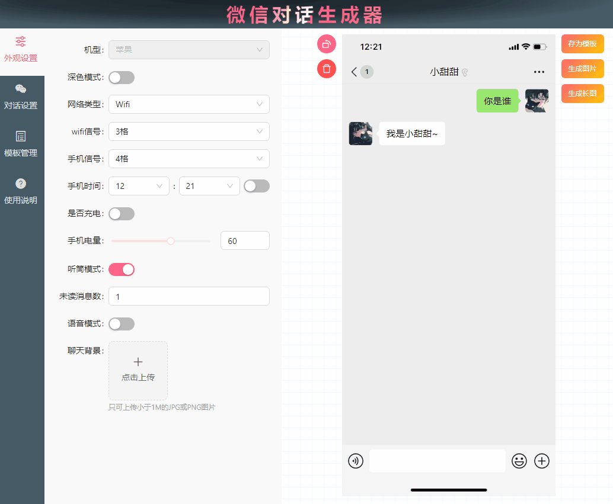

<h1 align="center">在线微信对话生成器 👋</h1>

> 使用 Vite + Vue3 + AntDesignVue + Pinia 搭建的在线微信对话生成器

<div align="center">
  <h4>本程序是一款微信聊天记录制作工具，可以模拟微信聊天、管理不同用户角色进行对话，同时支持发送文字、图片、语音、红包、转账等类型信息。可以将聊天内容一键生成为图片、长图、动图和视频。【<a href='https://ele-cat.gitee.io/vue3-wechat-tool/' target="_blank">在线使用地址</a>】</h4>
  <h4>全量开源，更多好玩的功能欢迎提出Issues，敬请期待！</h4>
</div>

<div align="center">
  <a href='https://gitee.com/ele-cat/vue3-wechat-tool/stargazers' target="_blank"></img></a>
  <a href='https://gitee.com/ele-cat/vue3-wechat-tool/members' target="_blank"></img></a>
</div>

<!--  -->

### 👉<a href='https://www.bilibili.com/video/BV1Q84y1S7iA/?share_source=copy_web&vd_source=a365c12124cceb4ffcbdc878f6f2ef60' target="_blank">使用视频教程</a>

### 👉<a href='https://ele-cat.gitee.io/tools/Vue3WechatTool.html#使用教程' target="_blank">使用教程【文本】</a>

### 👉<a href='https://ele-cat.gitee.io/tools/Vue3WechatTool.html#开发教程' target="_blank">开发教程</a>

### ✨<a href='https://ele-cat.gitee.io/vue3-wechat-tool/' target="_blank">在线使用</a>

## 截图预览




## 功能清单

> √ 为已实现的，规划中的功能有序安排中，欢迎提出反馈

- [x] 界面结构
- [x] 外观设置
  - [x] 基础外观设置
  - [x] 上传图片裁剪
  - [x] 深色模式
  - [ ] 机型切换
- [x] 对话设置
  - [x] 用户管理
  - [x] 消息发送
    - [x] 发送文本、表情
    - [x] 发送图片
    - [x] 发送转账
    - [x] 发送红包
    - [x] 发送语音条
    - [x] 语音条转文字
    - [x] 时间
    - [x] 发送视频、音频聊天
    - [x] 拍一拍
    - [x] 撤回消息
    - [x] 消息被拒收
    - [x] 手机聊天输入框同步展示文本
  - [x] 对话内容操作【右键菜单】
    - [x] 对话上移、下移
    - [x] 对话移除
    - [x] 对话领取红包、转账
    - [x] 对话修改
    - [ ] 对话播放延时【生成动图、视频时，自定义距上条对话内容播放的延时时间】
  - [x] 小工具
    - [x] 重置外观
    - [x] 清空对话
  - [x] 生成操作
    - [x] 存为模板
    - [x] 生成图片
    - [x] 生成长图
    - [x] 生成动图、视频配置
    - [x] 生成动图
    - [x] 生成视频【实际为生成图片序列】
    - [x] 聊天内容导入导出
  - [ ] **群聊**
- [x] 模板管理
  - [x] 对话内容保存为模板
  - [x] 应用模板
  - [x] 预览模板
  - [x] 删除模板
- [x] 使用说明

## 使用

- #### 安装

  ```
  npm install
  ```

- #### 运行

  ```
  npm run serve
  ```

- #### 打包

  打包前请注意将`.env.production`的`VITE_BASE_PATH`修改为`/`

  ```
  npm run build
  ```

## 更新日志

**2023-09-21**
- 🌟新增生成视频功能【实际为生成图片序列】

**2023-09-20**
- 🌟新增导入导出聊天功能
- 👌重构生成功能

**2023-09-19**
- 🌟新增生成动图功能
- 🌟新增生成动图、视频配置【思考时间】

**2023-09-18**
- 🌟新增<a href='https://www.bilibili.com/video/BV1Q84y1S7iA/?share_source=copy_web&vd_source=a365c12124cceb4ffcbdc878f6f2ef60' target="_blank">使用视频教程</a>
- 🌟新增模板管理标题修改功能

**2023-09-18**
- 🌟新增对话修改功能【右键菜单】
- 🌟新增工具使用教程<a href='https://ele-cat.gitee.io/tools/Vue3WechatTool.html#使用教程' target="_blank">使用教程</a>
- 🐞修复一系列系统遗留问题

**2023-09-17**
- 🌟新增发送音频、视频邀请功能
- 🌟新增拍一拍、撤回消息、消息被拒收功能
- 🐞修复保存长图时背景图问题

**2023-09-16**
- 🌟新增深色模式
- 🌟新增语音条转文字功能

**2023-09-15**
- 🌟新增模板预览功能

**2023-09-14**
- 🌟新增图片上传裁剪组件 `vue-advanced-cropper`
- 🌟新增用户输入文本同步展示在聊天输入框功能
- 🌟新增保存、应用模板功能

**2023-09-13**
- 🌟新增领取红包、转账功能【右键菜单】
- 🐞修复保存长图最小高度问题

**2023-09-12**
- 🌟新增保存图片、长图功能 `html2canvas`

**2023-09-11**
- 🌟新增移动端打开提示去web端
- 🐞调整手机组件、表情包组件为异步，加快首屏渲染速度

**2023-09-10**
- 🌟新增发送语音条功能
- 🐞调整一系列样式问题

**2023-09-09**
- 🌟新增聊天工具【重置外观、清空聊天】
- 🌟新增聊天条目上移、下移、移除功能【右键菜单】
- 🌟新增上传聊天图片、转账、红包功能
- 🐞修复聊天发送表情功能

**2023-09-08**
- 🌟完成项目聊天与用户解耦

**2023-09-07**
- 🌟新增手机外观设置联动
- 🌟新增用户管理功能
- 🐞优化界面滚动条样式 `vue3-perfect-scrollbar`

**2023-09-06**
- 🌟新增文本+表情包发送
- 🌟完成项目数据持久化 `pinia`、`pinia-plugin-persist`
- 🌟完成项目组件结构抽离
- 🌟新增使用说明
- 🌟新增免责声明
- 🐞修复线上图片引用问题

**2023-09-05**
- 🌟项目立项
- 🌟完成项目基础结构
- 🌟完成基础外观设置

## 支持

如果这个项目对你有帮助请给一个 ⭐️ 予以鼓励！
